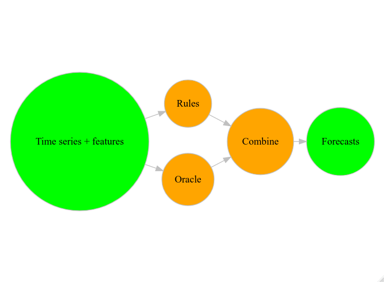

<!-- README.md is generated from README.Rmd. Please edit that file -->

```{r, include = FALSE}
knitr::opts_chunk$set(
  collapse = TRUE,
  comment = "#>",
  fig.path = "man/figures/README-",
  out.width = "100%"
)
```

# soothsayer

<!-- badges: start -->
[](https://lifecycle.r-lib.org/articles/stages.html#experimental)
[](https://github.com/JSzitas/soothsayer/actions)
[](https://codecov.io/gh/JSzitas/soothsayer?branch=main)
[](https://CRAN.R-project.org/package=soothsayer)
<!-- badges: end -->


**soothsayer** provides tools for automation of time series model selection.

This is achieved by fitting your own version of Feature-based Forecast Model Selection (FFORMS), as described in . 
The package does this in a way that tries to leverage the **tidy** framework.

## Workflow 



* compute time series features (e.g. Box-Pierce statistic, time series entropy, ...)
* run a **set of rules**, or an **oracle** model for fitting models 
* generate forecast combinations 

The forecast rules are implemented directly in the model, i.e. the following is perfectly valid and runnable code: 

```{r}
library(fabletools)
library(soothsayer)

ex_data <- tsibbledata::aus_livestock %>%
  as.data.frame() %>%
  dplyr::group_by(Month, State) %>%
  dplyr::summarise(count = sum(Count)) %>%
  dplyr::ungroup() %>%
  tsibble::as_tsibble(index = "Month", key= "State")

train <- dplyr::filter(ex_data, Month <= tsibble::yearmonth("2017 Jan"))
test <- dplyr::filter( ex_data, Month > tsibble::yearmonth("2017 Jan") )

mdls <- fabletools::model(
  train,
  ar = fable::ARIMA( count ),
  arima = fable::ARIMA(count),
  soothsayer = soothsayer(count ~ 
                            # only fit arima if there is over 12 observations
                            rules(arima ~ .length > 12,
                                  # always fit an AR model 
                                  ar ~ TRUE,
                                  # only fit ets if length is over 15
                                  ets ~ .length > 15))
)
```

Note that this works seamlessly with fitting any model in the **fable** package 
and models which work in the **fabletools** framework. This includes, among others 
[fable.tbats](https://github.com/JSzitas/fable.tbats), the wrapper for the TBATS
model. 

This then works just like any other model in **fable**, and generating forecasts
is seamless: 

```{r}
forecast(mdls, test) %>% 
  # only a subset of forecasts plotted for visibility
  dplyr::filter(State == "Western Australia") %>% 
  ggplot2::autoplot(test)
```

# Combinations

**soothsayer** also supports forecast combinations. Following the example above, 
by default, soothsayer creates an equally weighed combination of all models
which are matched:

```{r}
# this is identical to the above 
mdls <- fabletools::model(
  train,
  ar = fable::ARIMA( count ),
  arima = fable::ARIMA(count),
  soothsayer = soothsayer(count ~ 
                            rules(arima ~ .length > 12,
                                  ar ~ TRUE,
                                  ets ~ .length > 15) + 
                            # note the explicit combiner, though
                            combiner(combiner_equal))
)
```

However, multiple combiners are implemented within the package - 
a good example being the **'greedy stacking'** one (See [1]): 

```{r}
# this is identical to the above 
mdls <- fabletools::model(
  train,
  ar = fable::ARIMA( count ),
  arima = fable::ARIMA(count),
  soothsayer = soothsayer(count ~ 
                            rules(arima ~ .length > 12,
                                  ar ~ TRUE,
                                  ets ~ .length > 15) + 
                            # note the explicit combiner, though
                            combiner(combiner_greedy_stacking))
)
```

These allow you to implement specific types of weighed combinations, including 
preset weights (**combiner_custom**). Further, note that the combiner argument 
takes a function - any function with the following signature:

```{r}
new_combiner <- function(.models, ...) {
  # your code goes here
}
```

this is expected to return a vector of weights in the same order as **.models**,
where **.models** is the fitted model *mable** object.  

# Adding soothsayers to existing mables

TODO: Document 

# References

+ [1] Kurz, Maier & Rink; 'A greedy stacking algorithm for model ensembling and domain weighting',
BMC Research Notes volume 13, Article number: 70 (2020)
(See full text at https://bmcresnotes.biomedcentral.com/articles/10.1186/s13104-020-4931-7)

